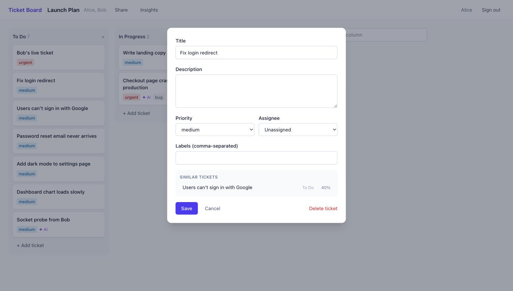

# Ticket Board

A real-time collaborative kanban board with an AI triage layer — a small Linear/Jira.
Drag a ticket and every teammate's screen updates instantly. New tickets are auto-labelled
and prioritised by an LLM, and a vector search surfaces similar existing tickets.



## Features

- **Real-time collaboration** — Socket.io rooms per board; optimistic drag-and-drop with rollback;
  a Redis pub/sub adapter so events reach users connected to *different* API instances.
- **AI triage** — on creation, an LLM (Gemini free tier or Claude Haiku 4.5, behind a
  `TriageProvider` interface) suggests labels and priority, constrained to a strict schema.
  Falls back to deterministic rules if the LLM fails. Suggestions never overwrite what a user chose.
- **Semantic similar-ticket search** — `all-MiniLM-L6-v2` embeddings computed locally in a Python
  service, stored in Postgres with **pgvector**, queried with a hand-written cosine-distance query on an HNSW index.
- **Board insights** — analytics in raw SQL (`LEFT JOIN`, `unnest`, `generate_series`, `FILTER`).
- **GraphQL** read API alongside REST, with DataLoader batching to avoid N+1 queries.
- **Auth** — JWT + bcrypt, board membership checks on every REST route, socket room, and GraphQL query;
  login rate limiting.

## Architecture

```
 browser ──► web/  React + TypeScript + Tailwind (Vite)
               │  REST · GraphQL · WebSocket
               ▼
            api/  Express + TypeScript ── Prisma ──► Postgres + pgvector
               │  Socket.io + Redis adapter ───────► Redis (cache + pub/sub)
               │  HTTP
               ▼
            ai-service/  FastAPI (Python) — embeddings + LLM triage, stateless, no DB access
```

| | |
|---|---|
| **Frontend** | React 19, TypeScript, Tailwind 4, dnd-kit, Socket.io client, Vitest + Testing Library |
| **API** | Node 24, Express 5, TypeScript, Prisma 7, Zod, Socket.io, graphql-yoga, DataLoader, Vitest + Supertest |
| **AI service** | Python 3.12, FastAPI, sentence-transformers, Anthropic SDK, pytest |
| **Data** | PostgreSQL 16 + pgvector (HNSW), Redis 7 |
| **Infra** | Docker, Docker Compose, GitHub Actions, Render / Supabase / Upstash / Cloudflare Pages, Terraform (AWS ECS Fargate, RDS, ElastiCache, ALB) |

## Run it locally

Requires Docker, Node 24, Python 3.12.

```bash
# Everything in containers — http://localhost:8080
docker compose --profile app up --build
```

Or run services individually, with hot reload:

```bash
docker compose up -d                                  # Postgres :5433 + Redis :6379

cd api && cp .env.example .env && npm install
npm run db:migrate && npm run dev                     # :3000

cd ai-service && python3.12 -m venv .venv && .venv/bin/pip install -r requirements-dev.txt
.venv/bin/uvicorn app.main:app --port 8001            # :8001

cd web && npm install && npm run dev                  # :5173
```

No API keys needed: without `GEMINI_API_KEY` / `ANTHROPIC_API_KEY`, triage uses the keyword rules.

## Tests

```bash
cd api && npm test            # 36 tests against real Postgres + Redis (docker compose up -d first)
cd web && npm test            # 19 component and state tests
cd ai-service && .venv/bin/pytest            # 17 tests; RUN_MODEL_TESTS=1 also runs the real model
```

CI (`.github/workflows/ci.yml`) runs lint, typecheck, tests, build, and dependency audit for every
service, builds the Docker images, and validates the Terraform.

## Deploy

- **Free, permanent:** [`docs/DEPLOY.md`](docs/DEPLOY.md) — Render + Supabase + Upstash + Cloudflare Pages.
- **AWS, time-boxed:** [`infra/README.md`](infra/README.md) — Terraform for ECS Fargate, RDS, ElastiCache.

## Docs

- [`docs/INTERVIEW.md`](docs/INTERVIEW.md) — how each subsystem works, trade-offs, likely questions
- [`HANDOFF.md`](HANDOFF.md) — plan, decisions, and current state
