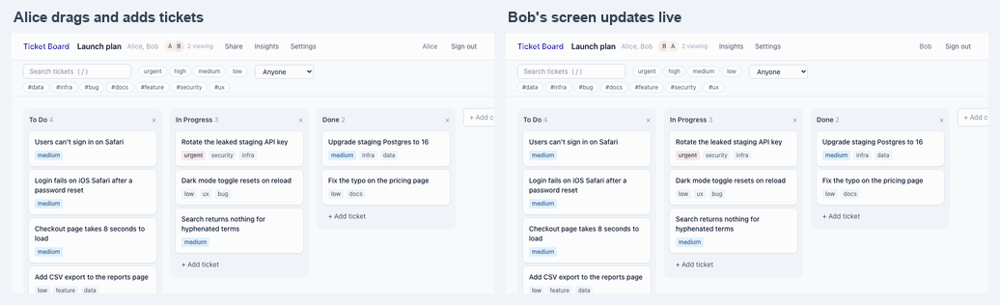
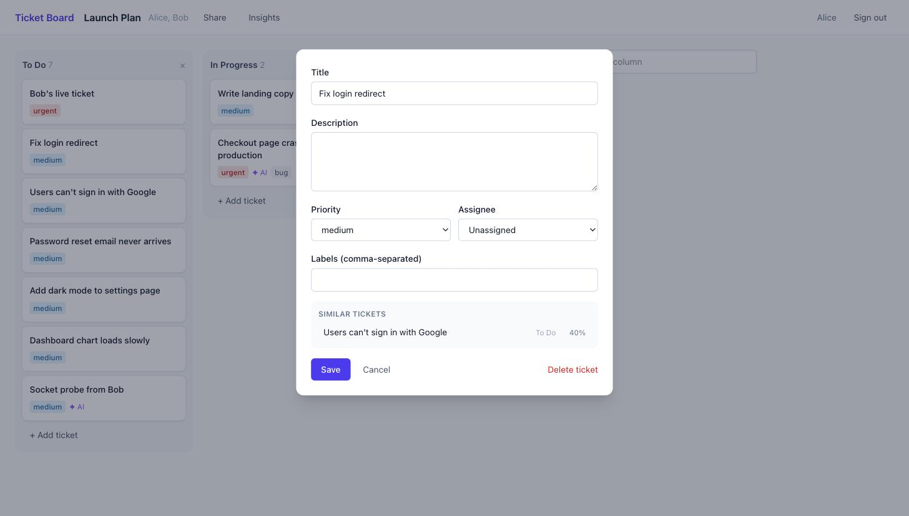

# Ticket Board

A real-time collaborative kanban board with an AI triage layer — a small Linear/Jira.
Drag a ticket and every teammate's screen updates instantly. New tickets are auto-labelled
and prioritised by an LLM, and a vector search surfaces similar existing tickets.

**Live demo:** https://ticket-board-xi.vercel.app — click **Try the demo** for a temporary account with a
sample board, no sign-up. The free-tier API sleeps when idle, so the first request can take up to a minute
(the app says so while it waits).



## Features

**Collaboration**
- **Real-time sync** — Socket.io rooms per board; optimistic drag-and-drop with rollback; live presence
  avatars. A Redis pub/sub adapter delivers events and presence to users on *different* API instances.
- **Conflict detection** — tickets carry a version, and saves are a compare-and-swap
  (`UPDATE … WHERE version = ?`). A stale save gets a 409 with the current ticket, and the editor
  offers "load their changes" or "overwrite with mine". Out-of-order socket events are dropped.
- **Sharing** — people with an account are added directly; anyone else gets a one-time invite link
  (hashed at rest, 7-day expiry, single use). Owners can rename, delete, and remove members; members
  can leave. Removal also evicts the person's open sockets from the board's room on every instance.
- **Search and filters** — text, priority, label and assignee, computed client-side over the live
  board and kept in the URL so a filtered view can be shared. Drag-and-drop still works while filtered.

**AI**



- **Triage** — on creation, an LLM (Gemini free tier or Claude Haiku 4.5, behind a `TriageProvider`
  interface) suggests labels and priority, constrained to a strict schema. Falls back to deterministic
  rules if the LLM fails. Suggestions never overwrite what a user chose.
- **Similar-ticket search** — `all-MiniLM-L6-v2` embeddings computed locally in a Python service, stored
  in Postgres with **pgvector**, queried with a hand-written cosine-distance query on an HNSW index.

**Data and APIs**
- **Board insights** — analytics in raw SQL (`LEFT JOIN`, `unnest`, `generate_series`, `FILTER`).
- **GraphQL** read API alongside REST, with DataLoader batching to avoid N+1 queries.
- **MCP server** — an AI assistant (Claude Desktop, Claude Code) can list, search, create, move and
  triage tickets. It goes through the REST API, so its changes appear live on everyone's board.

**Security**
- JWT + bcrypt; board membership checked on every REST route, socket room and GraphQL query.
- Rate limiting on password and guest-account endpoints, keyed on the real client IP behind proxies.
- Postgres row-level security on every table, with a test that fails if a new table lacks it.

**Built to be clicked by strangers**
- **Try it without signing up** — one click creates a guest account with a seeded demo board.
  Guests have no password, their token lasts 24 hours, and expired guests are deleted with their boards.
- **Cold starts explained** — every request goes through one client, which shows a "waking up the
  server" banner when anything takes over 3 seconds; skeletons replace blank loading states.
- **Readable failures** — confirm dialogs and toasts instead of browser pop-ups, and errors in plain
  language ("The server isn't responding") rather than status codes.
- **Phones** — the layout fits a 375px screen, and touch drags use press-and-hold so swiping scrolls.
- **Uptime** — `/health` (liveness) and `/health/ready` (checks Postgres and Redis); a scheduled
  GitHub Action keeps the free tiers awake and fails loudly if a dependency is down.

## Architecture

```
 browser ──► web/  React + TypeScript + Tailwind (Vite)
               │  REST · GraphQL · WebSocket
               ▼
            api/  Express + TypeScript ── Prisma ──► Postgres + pgvector
               │  Socket.io + Redis adapter ───────► Redis (cache + pub/sub)
               │  HTTP
               ▼
            ai-service/  FastAPI (Python) — embeddings + LLM triage, stateless, no DB access

 AI assistant ──stdio──► mcp-server/  MCP (TypeScript SDK) ──REST──► api/
```

| | |
|---|---|
| **Frontend** | React 19, TypeScript, Tailwind 4, dnd-kit, Socket.io client, Vitest + Testing Library |
| **API** | Node 24, Express 5, TypeScript, Prisma 7, Zod, Socket.io, graphql-yoga, DataLoader, Vitest + Supertest |
| **AI service** | Python 3.12, FastAPI, sentence-transformers, Anthropic SDK, pytest |
| **Data** | PostgreSQL 16 + pgvector (HNSW), Redis 7 |
| **Infra** | Docker, Docker Compose, GitHub Actions, Render / Supabase / Upstash / Vercel, Terraform (AWS ECS Fargate, RDS, ElastiCache, ALB) |

## Run it locally

Requires Docker, Node 24, Python 3.12.

```bash
# Everything in containers — http://localhost:8080
docker compose --profile app up --build
```

Or run services individually, with hot reload:

```bash
docker compose up -d                                  # Postgres :5433 + Redis :6379

cd api && cp .env.example .env && npm install
npm run db:migrate && npm run dev                     # :3000

cd ai-service && python3.12 -m venv .venv && .venv/bin/pip install -r requirements-dev.txt
.venv/bin/uvicorn app.main:app --port 8001            # :8001

cd web && npm install && npm run dev                  # :5173
```

No API keys needed: without `GEMINI_API_KEY` / `ANTHROPIC_API_KEY`, triage uses the keyword rules.

## Use it from an AI assistant (MCP)

`mcp-server/` is a [Model Context Protocol](https://modelcontextprotocol.io) server. An assistant
starts it as a local process and talks to it over stdio; it calls the REST API as you, so board
membership, validation and real-time updates all apply exactly as in the web app.

| Tool | What it does |
|---|---|
| `list_boards` | Boards you're a member of |
| `list_tickets` | A board's tickets, filtered by column, label, assignee or priority |
| `get_ticket` | One ticket in full, including the AI's triage suggestion |
| `search_similar_tickets` | Semantic search by free text, or "tickets like this one" (pgvector) |
| `create_ticket` | New ticket; AI fills in priority and labels you leave out |
| `update_ticket` | Edit fields; pass `version` to get a conflict instead of overwriting |
| `move_ticket` | Move to a column by name, at the bottom or a given position |
| `triage_ticket` | A fresh AI suggestion for priority and labels, not applied |

It also exposes each board as a resource (`ticketboard://boards/{id}`, Markdown) and a
`triage_backlog` prompt.

```bash
cd mcp-server && npm install && npm run build
npm run inspect          # try it in the MCP Inspector (set the env vars below first)
```

Configure it with environment variables:

| Variable | |
|---|---|
| `TICKETBOARD_API_URL` | API base URL. `http://localhost:3000` (default) for `npm run dev`, `http://localhost:8080/api` for the Compose stack |
| `TICKETBOARD_EMAIL` + `TICKETBOARD_PASSWORD` | Your account; the server signs in and signs in again when the 7-day token expires |
| `TICKETBOARD_TOKEN` | Or a token, e.g. a guest's: `localStorage["ticketboard.token"]` in the browser. Can't be renewed |

**Claude Code:**

```bash
claude mcp add ticketboard -e TICKETBOARD_EMAIL=you@example.com -e TICKETBOARD_PASSWORD=... -- node /absolute/path/to/ticket-board/mcp-server/dist/index.js
```

**Claude Desktop** — add to `claude_desktop_config.json` (Settings → Developer → Edit Config), then restart:

```json
{
  "mcpServers": {
    "ticketboard": {
      "command": "node",
      "args": ["/absolute/path/to/ticket-board/mcp-server/dist/index.js"],
      "env": {
        "TICKETBOARD_API_URL": "http://localhost:3000",
        "TICKETBOARD_EMAIL": "you@example.com",
        "TICKETBOARD_PASSWORD": "..."
      }
    }
  }
}
```

The password sits in plain text in that file, as with any MCP server's credentials. Use an account
made for the purpose, or a token.

## Tests

```bash
cd api && npm test            # 91 tests against real Postgres + Redis (docker compose up -d first)
cd web && npm test            # 67 component and state tests
cd ai-service && .venv/bin/pytest            # 17 tests; RUN_MODEL_TESTS=1 also runs the real model
cd e2e && npm test            # 6 end-to-end browser tests (Playwright) against the real stack
cd mcp-server && npm test     # 32 tests: every MCP tool through a real MCP client, plus stdio against a real API
```

The end-to-end suite starts its own API and web server on separate ports with its own database,
then drives Chromium through the flows that span pages and users: the guest demo, a drag syncing
to a teammate's screen, conflicting edits, joining through an invite link, being removed from a
board, and search. The README animation above is recorded by the same tooling
(`cd e2e && npm run demo-gif`).

CI (`.github/workflows/ci.yml`) runs lint, typecheck, tests, build, and dependency audit for every
service, the end-to-end suite in Chromium, builds the Docker images, and validates the Terraform.

## Deploy

- **Free, permanent:** [`docs/DEPLOY.md`](docs/DEPLOY.md) — Render + Supabase + Upstash + Vercel.
- **AWS, time-boxed:** [`infra/README.md`](infra/README.md) — Terraform for ECS Fargate, RDS, ElastiCache.
